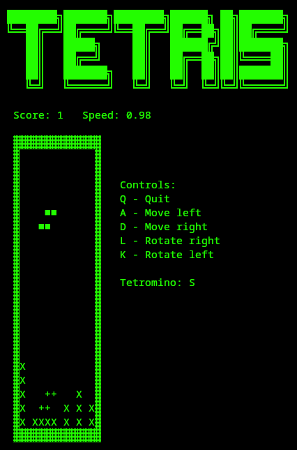

# 🎮 TETRIS: Terminal Edition!

A masterpiece of rushed coding, where all the basic functionality was thrown together in just three days—because why not? Performance is questionable, the code is spaghetti, but hey, it works.

Will I keep updating it? Maybe. For now, enjoy this definitely-optimized terminal Tetris experience!

---

## 🖼️ Screenshot

  
_A cool screenshot of the game in action._

---

## 🎯 How to Play

The goal of Tetris is simple: **stack the falling blocks (tetrominoes)** to complete horizontal lines without gaps. When a line is completed, it disappears, and you earn points. The game gets faster as your score increases, so stay sharp!

---

## 🕹️ Controls

Here are the controls to play the game:

- **`A`**: Move the tetromino **left**.
- **`D`**: Move the tetromino **right**.
- **`S`**: Move the tetromino **down** (soft drop).
- **`W`**: Move the tetromino **drop down** (hard drop).
- **`K`**: Rotate the tetromino **left**.
- **`L`**: Rotate the tetromino **right**.
- **`C`**: Swaps tetromino for one in storage **swap**.
- **`Q`**: Quit the game.

---

## 🏆 Scoring and Mechanics

- **Scoring**:

  - Clearing **1 line** gives you **1 point**.
  - Clearing **2 lines** gives you **3 points**.
  - Clearing **3 lines** gives you **5 points**.
  - Clearing **4 lines** (a Tetris!) gives you **7 points**.

- **Speed Increase**:  
  The game speeds up as your score increases, making it more challenging. The speed is calculated based on your score, with a maximum speed cap to keep things fair.

- **Game Over**:  
  The game ends when a tetromino can no longer spawn at the top of the matrix. Your final score is displayed on the **Game Over** screen.

---

## ✅ TODO

Here are some ideas for future improvements and features:

- **High Score System**: Save and display the highest score achieved.
- **Timer**: Display playtime.
- **Pause Functionality**: Add a pause feature to temporarily stop the game.

---

## 🛠️ Installation and Running the Game

1. **Clone the repository** (if applicable):

   ```bash
   git clone https://github.com/Domza64/Python-Tetris.git
   cd Python-Tetris/
   ```

2. **Run the game**:

   ```bash
   python main.py
   ```

3. **Enjoy the game** in your terminal!

Made with ❤️ by [Domza64](https://domza.xyz).  
Feel free to contribute or suggest improvements!
